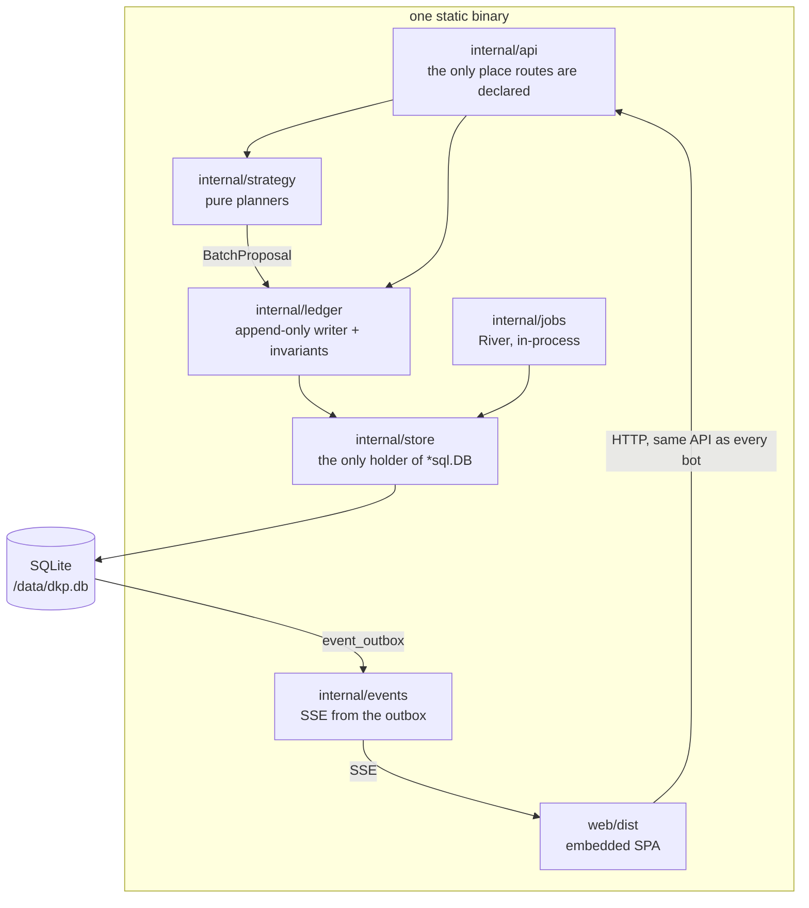

# Architecture overview

**Status:** the structure below is the target. Most packages do not exist yet; see
[ROADMAP.md](../../ROADMAP.md) for the phase each lands in. The rules are already in force — they
govern the code as it is written, not after.

One Go binary. One SQLite file. One volume. One port. The React app is embedded with `go:embed` and is
a pure API client. Everything else follows from that.

## The shape



The arrow that is missing is the point: nothing reaches `store` except through `ledger` for money, and
nothing reaches the database except through `store`.

## The laws this shape enforces

That diagram is the picture of four rules — route declaration, `*sql.DB` ownership, strategy purity,
and where `fetch` may be called. [AGENTS.md](../../AGENTS.md) states them normatively and is the only
place they are written down; they are not restated here, because a rule with two copies has one copy
too many and no way to tell which is stale. Each is held by an architectural test, an import-graph
test, a lint rule or a CI grep, not by trust.

One more rule belongs to the architecture rather than to that list, and it is the one that makes the
API claim real: **the SPA is a pure API client.** A test replays the web UI's exact requests using a
scoped token and fails the build if any capability turns out to be browser-only. There is no BFF, no
server actions, no UI-private endpoint. Exactly three surfaces are server-rendered — the first-run wizard, `/ops`, and public standings — each because a single-page app
is a liability there.

## Where code goes

| Directory | Holds | Rule attached to it |
|---|---|---|
| `cmd/dkp/` | The only binary | Cobra wiring only. No logic. |
| `internal/api/` | Handlers, middleware, the OpenAPI surface | The only tree where a route may be declared. Copy `EXAMPLE_ENDPOINT.md` end to end. |
| `internal/store/` | Queries, transactions, the connection | The only package that may hold `*sql.DB`. Every mutation goes through `store.Tx`. Query shapes live in `db/RECIPES.md`. |
| `internal/ledger/` | The append-only writer and the invariant engine | Highest blast radius in the repository. Two approvals. |
| `internal/strategy/` | Point strategies | Pure. See law 3. |
| `internal/authz/` | The permission and scope catalogue | One catalogue, generated into the schema seed, the OpenAPI metadata and the docs |
| `internal/importer/` | The EQdkp Plus ETL | Two phases: stage verbatim, then transform. Dry run is the default. |
| `internal/parse/` | Project 1999 log adapters | One file plus one golden directory per format. Standard library only. |
| `internal/cms/` | Articles, comments, media, portal blocks | Where untrusted rich text lives |
| `internal/richtext/` | The markdown and HTML sanitiser | The only place user HTML is rendered |
| `internal/net/safehttp` | Outbound HTTP | The only place an `*http.Client` may be constructed |
| `db/schema.hcl` | The single source of schema truth | Atlas generates the migrations from it |
| `web/src/api/` | The generated client | Generated. Never hand-edited. |
| `test/golden/`, `test/fixtures/` | Expected outputs | CODEOWNERS-protected |

## Task to file

The routing table. Use it instead of grepping.

| Task | Go here | And nowhere else |
|---|---|---|
| Add or change an endpoint | `internal/api/` | Read `internal/api/EXAMPLE_ENDPOINT.md` first; use the `add-endpoint` skill |
| Add a query | `db/queries/` | Read `db/RECIPES.md`; run `make gen` |
| Change the schema | `db/schema.hcl` | `make migration NAME=…`; never edit a shipped migration |
| Add a point system | `internal/strategy/` | Use the `add-strategy` skill |
| Add or fix a log parser | `internal/parse/` | Use the `add-parser` skill; add a golden directory |
| Add a webhook event | The event catalogue | Use the `add-webhook-event` skill |
| Add an EQdkp compat function | `internal/api/compat/` | Use the `add-compat-function` skill |
| Trace a bug from a report | Start with a failing test | Use the `triage-bug` skill |

Skills live in `.claude/skills/`; path-scoped rules in `.claude/rules/` load when you open a matching
file. Read them rather than re-deriving them.

## The write path

Every mutation follows the same route. Money is the strict case; everything else is a subset.

```
HTTP request
  → middleware: authenticate → resolve principal → check permission ∩ scope
  → handler validates the typed request (Huma derives the spec from these types)
  → Idempotency-Key looked up; a replay returns the stored response and stops here
  → strategy.Plan*(ctx, event) → BatchProposal          pure, no database
  → ledger validates the proposal
        · the strategy's declared invariants
        · the non-waivable set: NoFloat, BatchNonEmpty, SeqMonotonic,
          EntriesReferenceLiveAccounts
  → store.Tx  (BEGIN IMMEDIATE — there is exactly one writer)
        · allocate the per-pool seq
        · insert the batch and its entries
        · update balance_snapshot in the same transaction
        · append to event_outbox in the same transaction
        · store the idempotency response
     COMMIT
  → the outbox reader turns rows into SSE frames and webhook deliveries
```

Three properties fall out of that ordering:

| Property | Because |
|---|---|
| Realtime cannot claim something the database does not have | The outbox row is written in the same transaction as the state change |
| A retry cannot double-charge | The idempotency response is stored inside the same transaction |
| A misconfigured strategy cannot corrupt the ledger | It only proposes; validation happens after |

## The read path

| Read | How |
|---|---|
| A balance | `SUM(amount)` over the covering index on entries, bounded by `seq`. The current balance comes from `balance_snapshot`, which is a droppable cache verified nightly. |
| Standings | One indexed scan of `balance_snapshot`, one of `attendance_rollup`, one roster join, one count. Four statements, and there is a test that says so. |
| An attendance percentage | The dated rollup row, so the number shown is the number a tie-break used |
| A statement | The entry index scanned backwards with a running total |
| Anything realtime | An event frame carries `{topic, event_type, event_seq, resource}`; the client refetches. **The stream never carries authoritative state.** |

## Determinism

Two injections make the whole system replayable:

| Injected | Consequence |
|---|---|
| `Clock` | `time.Now` is banned outside `internal/clock`. Tests pin time; production does not diverge from tests. |
| Seeded RNG | The seed is persisted onto the batch, so a tie broken by a coin flip three months ago resolves the same way today. |

This is what makes `dkp verify-ledger` meaningful: rebuild every balance from zero and it must match,
byte for byte.

## What is deliberately absent

Knowing the negative space saves you from adding something helpful.

| Not here | Instead |
|---|---|
| An ORM | sqlc. Standings are window-function shaped; an ORM forces raw SQL exactly where types matter. |
| Redis, a message broker, a sidecar | River jobs in process, and a transactional outbox |
| WebSockets | SSE. Bids are POSTs; the board is one-way, and `Upgrade` misconfiguration is the top self-hoster support ticket. |
| A mutable balance column | A derived cache over an immutable log |
| An all-powerful token | Capability is role permissions ∩ token scopes. There is no `admin:*`. |
| A `guild_id` column | One guild per instance. A hoster runs several containers. |
| Postgres at runtime | SQLite only in 1.0. A compile-time Postgres target is maintained at near-zero cost. |
| A plugin system | The API is the extension point. Build outside this repository, in any language. |

Each of these has an ADR. If you are about to add one, read it first — see [the index](../adr/README.md).

## Concurrency model

One writer. `SetMaxOpenConns(1)` on the write pool, `BEGIN IMMEDIATE` on every write transaction,
WAL mode for concurrent reads. SQLite has no sequences, so the per-pool `seq` is allocated inside the
write transaction with a unique index as the guardrail if the single-writer property is ever lost.

That guardrail matters for the post-1.0 Postgres target, where the same statement must become a
sequence or a locked counter row. It is one of only three places the two engines genuinely differ, and
it is flagged in `db/RECIPES.md`.

## Next

- [Inner loop](inner-loop.md) — the commands and the test layers
- [Invariants](../concepts/invariants.md) — every rule and its mechanism
- [The ledger](../concepts/ledger.md) · [Point strategies](../concepts/strategies.md)
- [Decision records](../adr/README.md) — why, with the downsides
